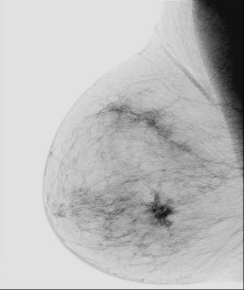
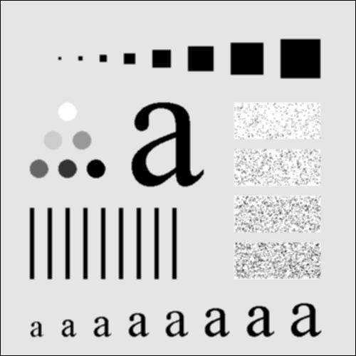
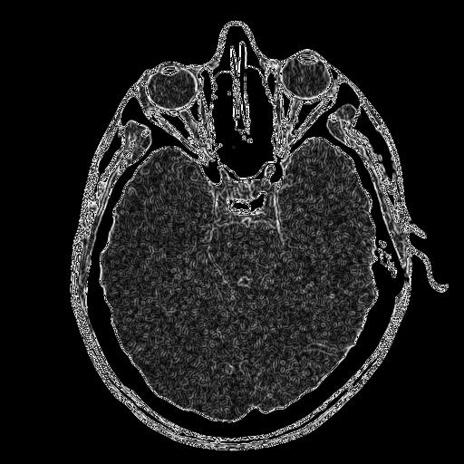
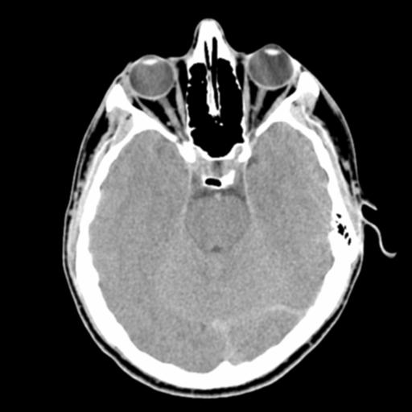
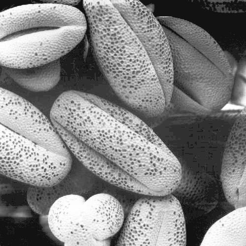
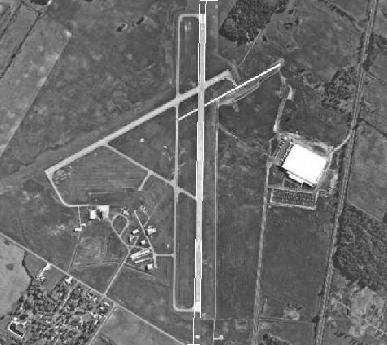

# Application of some computer vision concepts
Below are the topics covered in the code:-

Q1: Image negative

Q2: Image smoothing

Q3: Edge gradient magnitude estimation

Q4: Image sharpening

Q5: Median filtering

Q6: Histogram equalization

Q7: Line and paper detection

Q8: Image segmentation by global thresholding

Q9: Circle detection

